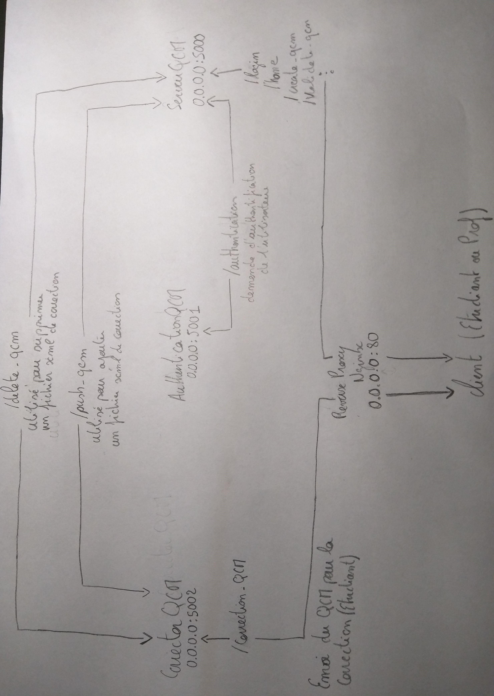

# <font color="#D91348"><center><u>Valerian-QCM </u></center></font>

### <font color="#D91348"><center>Conception d'une application de solution de QCM </center>

## <font color="#35D7DC">Requirement</font>

Python <font color="yellow">version 3.7</font> doit être utilisé pour lancer les applications, de plus des modules sont nécéssaires pour le bon fonctionnement de l'application :

##### Module <font color="yellow">flask</font>

```bash
pip3 install flask==1.0.2
```

##### Module <font color="yellow">lxml</font>

```bash
pip3 install lxml==4.2.5
```

##### Module <font color="yellow">requests</font>

```bash
pip3 install requests==2.21.0
```

## <font color="#35D7DC">Pourquoi Python et flask ?</font>


**1.** Parce qu'on m'a dit "tiens essaie python c'est pas mal", j'ai essayé, et j'ai adopté... `Ref. openclassrooms.com`

**2.** Python possède un nombre incalculable de librairies aussi utile que inutile ! dans le cas de Valerian-QCM le module lxml est utilisé pour gérer la lecture, l'extration des informations et l'écriture dans des fichiers XML.

**3.** Flask est un framework open-source de développement web en Python, c'est un ensemble de modules qui facilite la programmation de sites web dynamiques. et ainsi cela permet de ne pas re-créer ce qui à déjà été fait.

## <font color="#35D7DC">Pourquoi le nom Valerian ?</font>

C'est un film de Luc Besson que nous aimons particulièrement bien et qui sonné bien pour le nom de ce QCM, les couleurs bleu et blanche du QCM n'étant pas sans rappeler les couleurs de l'affiche du film.

## <font color="#35D7DC">Installation et lancement de l'application Valerian</font>

### <font color ="#426FE#61B2EF">Via docker (Simple)</font>

L'avantage de docker étant que vous n'avez pas besoin d'installer les prés-requis python, de plus l'installation et le lancement de Valerian-QCM est plus simple.

Il existe 3 version de Valerian-QCM sur docker :

* valerian-dev
* valerian-prod
* valerian-nginx

#### <font color ="#05BCEA"> valerian-dev </font>

valerian-dev utilise le cgi fournit par flask, or d'après la documentation de flask, ce cgi doit uniquement être utilisé dans un environnement de développement/test.

**Exemple 1 :**

```bash
docker run -d -p 5000:5000 -p 5002:5002 -e GLOBAL_IP="192.168.168.143" clementgiaime/valerian-dev
```

La variable `GLOBAL_IP` doit être indiqué lors de la commande `docker run`, l'adresse IP doit correspondre à l'adresse IP qui héberge le conteneur.

Pour accéder à l'application, il suffit de se connecter sur l'adresse suivante: http://GLOBAL_IP:5000/

**Exemple 2 :**

```bash
docker run -d -p 80:5003 -p 8080:5004 -e GLOBAL_IP="192.168.168.143" \
   -e BIND_PORT_QCM="5003" \
   -e BIND_PORT_CORRECTOR="5004" \
   -e PORT_SERVER_QCM="80" \
   -e PORT_SERVER_CORRECTOR="8080" clementgiaime/valerian-dev
```

Dans ce cas l'adresse de connection est: http://GLOBAL_IP/

Correspondance :

| VARIABLE ENVIRONEMENT    | DESCRIPTION                                                                                                               |
| ------------------------ | ------------------------------------------------------------------------------------------------------------------------- |
| `GLOBAL_IP`                | doit être indiqué lors de la commande docker run, l'adresse IP doit correspondre à l'adresse IP qui héberge le conteneur. |
| `BIND_PORT_QCM`           | Correspond au port d'écoute du serveur QCM                                                                                |
| `BIND_PORT_CORRECTOR`     | Correspond au port d'écoute du Corrector QCM                                                                              |
| `BIND_PORT_AUTHENTICATION` | Correspond au port d'écoute du authentification QCM                                                                       |
| `PORT_SERVER_QCM`          | Correspond au port le hôte sur lequel BIND_PORT_QCM est mappé                                                             |
| `PORT_SERVER_CORRECTOR`    | Correspond au port le hôte sur lequel BIND_PORT_CORRECTOR est mappé                                                       |

Bien sûr les ports mappés `-p 80:5003` et `-p 8080:5004` doivent correspondre avec les variables `PORT_SERVER_QCM`, `BIND_PORT_QCM`, `BIND_PORT_CORRECTOR` et `BIND_PORT_AUTHENTICATION`

#### <font color ="#05BCEA">valerian-prod </font>

Version de Valerian déployé selon les "best pratices", en utilisant Gunicorn. Gunicorn est un serveur web HTTP WSGI écrit en Python.

> While lightweight and easy to use, Flask’s built-in server is not suitable for production as it doesn’t scale well. Some of the options available for properly running Flask in production are documented here.

http://flask.pocoo.org/docs/1.0/deploying/

**Exemple 1 :**

```bash
docker run -d -p 5000:5000 -p 5002:5002 -e GLOBAL_IP="192.168.168.143" clementgiaime/valerian-dev
```

La variable `GLOBAL_IP` doit être indiquée lors de la commande `docker run`, l'adresse IP doit correspondre à l'adresse IP qui héberge le conteneur.

Pour accéder à l'application, il suffit de se connecter sur l'adresse suivante: http://GLOBAL_IP:5000/

**Exemple 2 :**

```bash
docker run -d -p 80:5003 -p 8080:5004 -e GLOBAL_IP="192.168.168.143" \
   -e BIND_PORT_QCM="5003" \
   -e BIND_PORT_CORRECTOR="5004" \
   -e PORT_SERVER_QCM="80" \
   -e PORT_SERVER_CORRECTOR="8080" clementgiaime/valerian-dev
```

Dans ce cas l'adresse de connection est : http://GLOBAL_IP/

Correspondance :

| VARIABLE ENVIRONEMENT    | DESCRIPTION                                                                                                               |
| ------------------------ | ------------------------------------------------------------------------------------------------------------------------- |
| `GLOBAL_IP`                | doit être indiqué lors de la commande docker run, l'adresse IP doit correspondre à l'adresse IP qui héberge le conteneur. |
| `BIND_PORT_QCM`            | Correspond au port d'écoute du serveur QCM                                                                                |
| `BIND_PORT_CORRECTOR`      | Correspond au port d'écoute du Corrector QCM                                                                              |
| `BIND_PORT_AUTHENTICATION` | Correspond au port d'écoute du authentification QCM                                                                       |
| `PORT_SERVER_QCM`          | Correspond au port le hôte sur lequel BIND_PORT_QCM est mappé                                                             |
| `PORT_SERVER_CORRECTOR`    | Correspond au port le hôte sur lequel BIND_PORT_CORRECTOR est mappé                                                       |

Bien sûr, les ports mappés `-p 80:5003` et `-p 8080:5004` doivent correspondre avec les variables `PORT_SERVER_QCM`, `BIND_PORT_QCM`, `BIND_PORT_CORRECTOR` et `BIND_PORT_AUTHENTICATION`

#### <font color ="#05BCEA">the best choice : valerian-nginx</font>

Valerian-nginx est la version la plus aboutie. En plus de respecter les "bests practices", elle intègre un reverse proxy qui ne requiert pas de configuration de la part de l'utilisateur.

```bash
docker run -d -p 80:80 clementgiaime/valerian-nginx
```

### <font color ="#426FE#61B2EF">Via le pull de l'application (Expert++)</font>

**1.** Installer les modules manquants.

**2.** Si les services sont lancés sur des machines différentes il faut alors modifier pour chaque service le fichier `configuration` présent à la racine du dossier. Sinon si les services sont sur la même machine, ne rien faire (c'est facile).

**3.** "Sourcer" le fichier de configuration avec la commande `source ./configuration`.

**4.** Lancer les services.

```bash
cd Corrector-QCM/
python3.7 app.py &
cd ..
cd Authentication-QCM/
python3.7 app.py &
cd ..
cd Server-QCM/
python3.7 app.py &
```

## <font color="#35D7DC">Architecture logiciels</font>



## <font color="#35D7DC"> Utilisation de l'application</font>

### <font color ="#426FE#61B2EF">Les utilisateurs</font>

Il existe deux types d'utilisateurs: les étudiants et les professeurs.

**Profil d'un étudiant :**

* Peut voir la liste des QCM qu'il peut faire
* Peut faire un QCM
* Peut voir la correction du QCM une fois celui-ci fait

Exemple de profil étudiant :

* GIAIME
* GULDNER

**Profil Professeur :**

* Voir la liste de ces QCM
* Supprimer un QCM
* Ajouter un nouveau QCM

> Un QCM est assosié à une matiere, mais une matière peut-être assosiée à plusieurs formations. Par exemple, GIAIME et GULDNER ont comme matière commune RT0701 et AN0701. Un QCM peut-être créé pour la matiere et ainsi être assosié à la formation AN0701. Dans ce cas GIAIME et GULDNER verront tout les deux le QCM.

Exemple de profil professeur :

* FLAUZAC
* BELLECAVE
* STEFFENEL

### <font color ="#426FE#61B2EF">Les menus</font>

#### Problèmes connus dans le développement

* Lors de la création d'un QCM, il est possible d'associer une matière avec une mauvaise formation.

#### Amélioration possibles

* Enregistrement des notes des QCM effectués par les étudiants.
* Affichage de tous les résultats des QCM effectués par les étudiants.
* Ajout d'une file de message pour la correction des QCM.

## <font color="#35D7DC">Conseil d'utilisation de l'application</font>

Utiliser l'application avec le conteneur **valerian-nginx**. Bonne correction ;).
